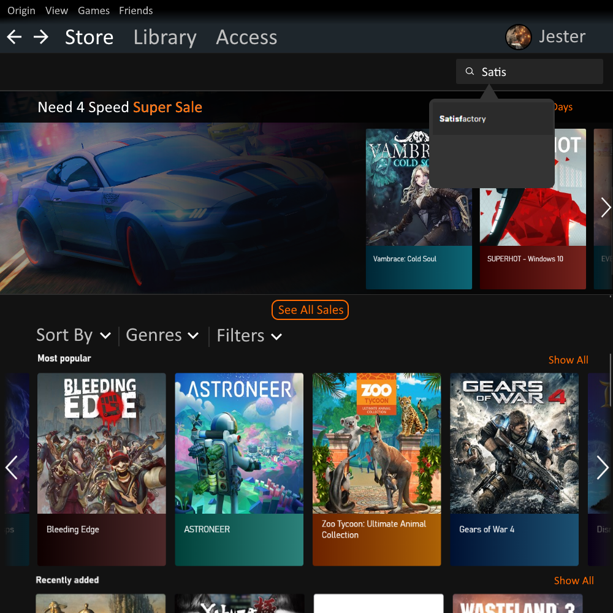
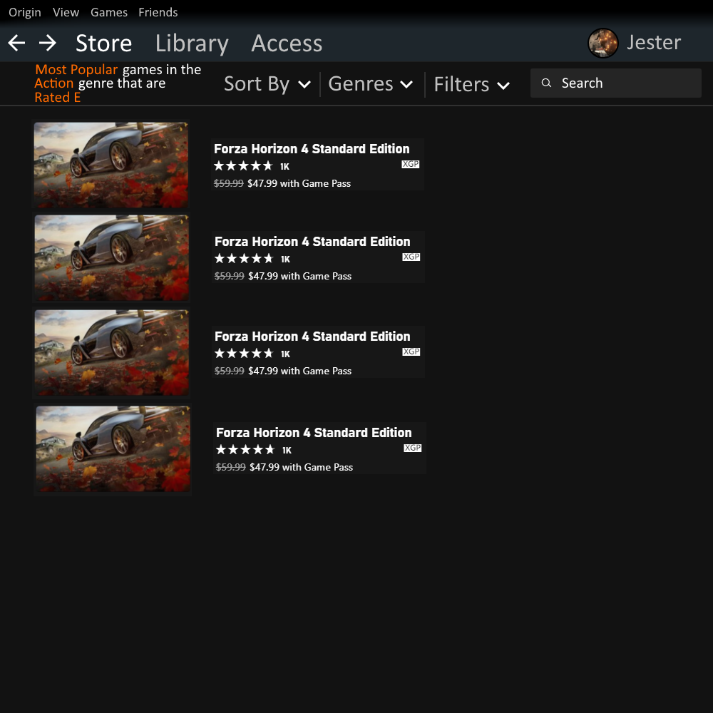
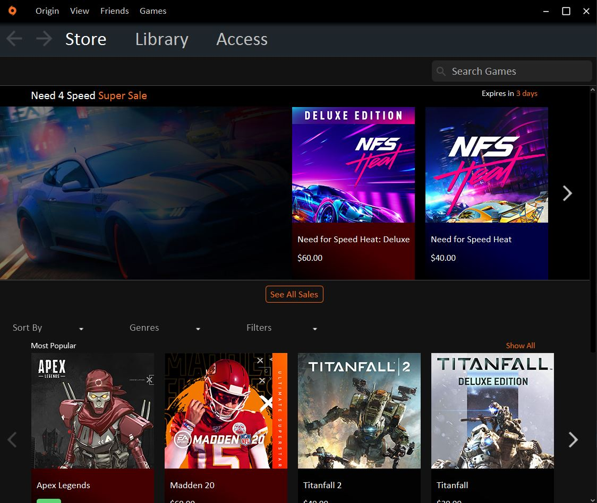
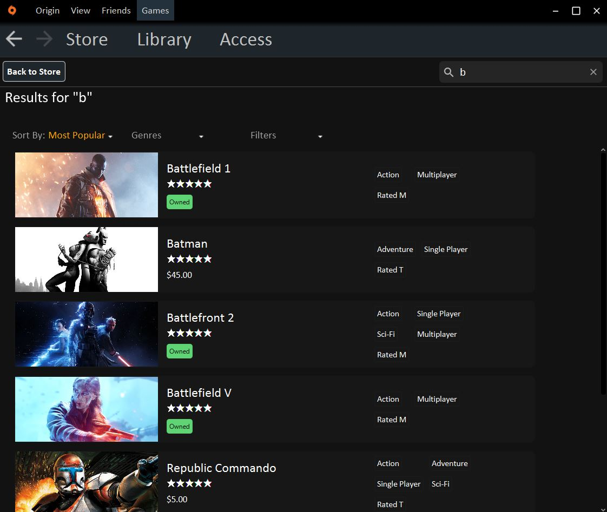
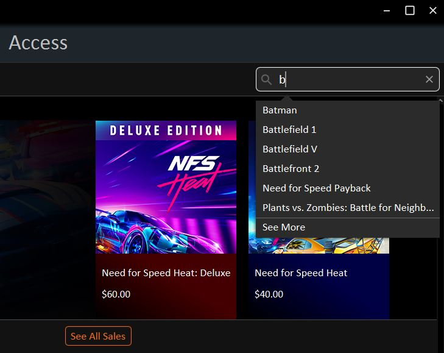
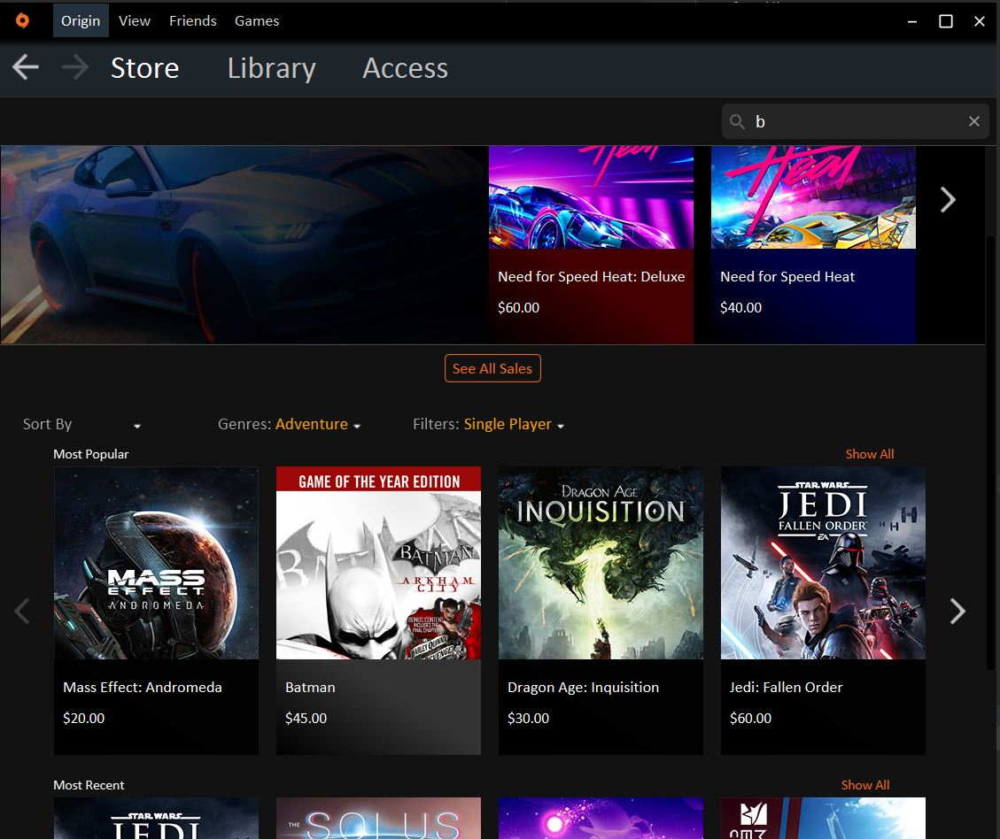

# 2450_origin
CS 2450 project to redesign the GUI of the native video game store: Origin.

## Getting Started

Clone this repo and launch IntelliJ.  Launch the `main` method from [src/origin/AppRoot.java](./src/origin/AppRoot.java)

## Concepts

You can find the images we used to guide our GUI development [here](./concept/images).

Store           |  Search Results
:-------------------------:|:-------------------------:
  |  

## Results

Here are screen shots of the final product.

Store           |  Search Results
:-------------------------:|:-------------------------:
  |  

Games can be searched and filtered.  All actions are easily reversible by using the navigation bar at the top of the application.

Search           |  Filter
:-------------------------:|:-------------------------:
  |  